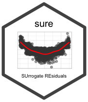

sure: Surrogate Residuals 
========================================================================================================

<!-- [](https://cran.r-project.org/package=sure) -->
[](https://travis-ci.org/koalaverse/sure)
[](https://ci.appveyor.com/project/koalaverse/sure)
[](https://codecov.io/gh/koalaverse/sure)

Overview
--------

An R package for constructing **SU**rrogate-based **RE**siduals and
diagnostics for ordinal and general regression models; based on the
approach described in [Dungang and Zhang
(2017)](http://www.tandfonline.com/doi/abs/10.1080/01621459.2017.1292915?journalCode=uasa20).

Installation
------------

The `sure` package is [currently listed on
CRAN](https://CRAN.R-project.org/package=sure) and can easily be
installed:

``` r
# Install from CRAN (recommended)
install.packages("sure")
  
# Alternatively, install the development version from GitHub
if (!requireNamespace("devtools")) install.packages("devtools")
devtools::install_github("koalaverse/sure")
```

References
----------

Liu, D. and Zhang, H. Residuals and Diagnostics for Ordinal Regression
Models: A Surrogate Approach. *Journal of the American Statistical
Association* (accepted). URL
<http://www.tandfonline.com/doi/abs/10.1080/01621459.2017.1292915?journalCode=uasa20>

Greenwell, B.M., McCarthy, A.J., Boehmke, B.C. & Dungang, L. (2018)
“Residuals and diagnostics for binary and ordinal regression models: An
introduction to the sure package.” The R Journal (pre-print). URL
<https://journal.r-project.org/archive/2018/RJ-2018-004/index.html>
